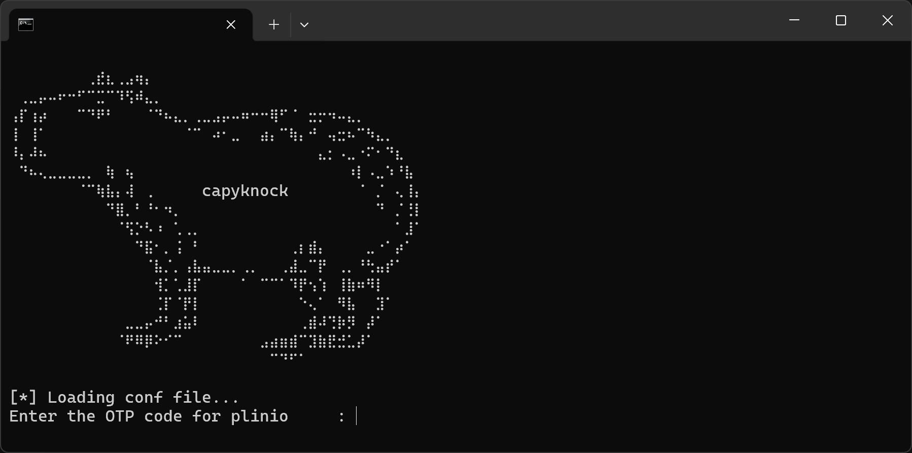
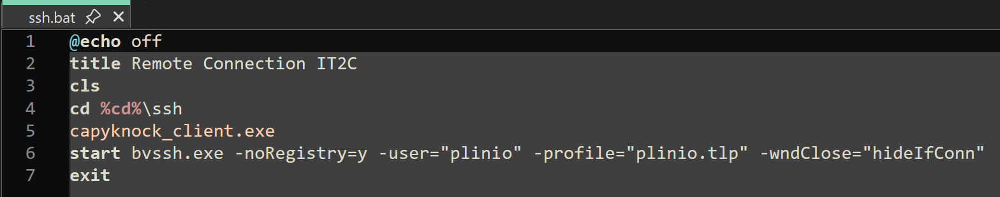
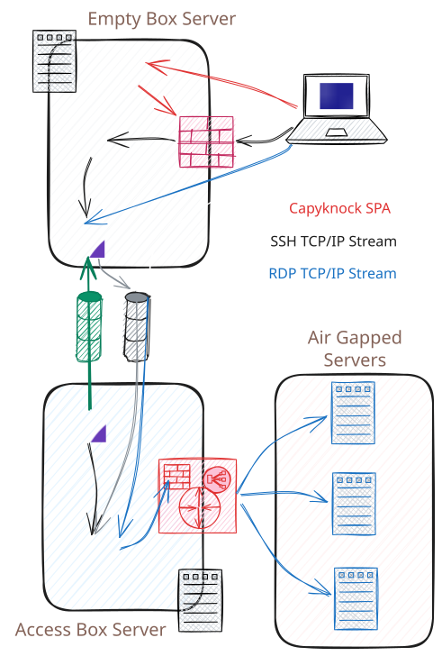
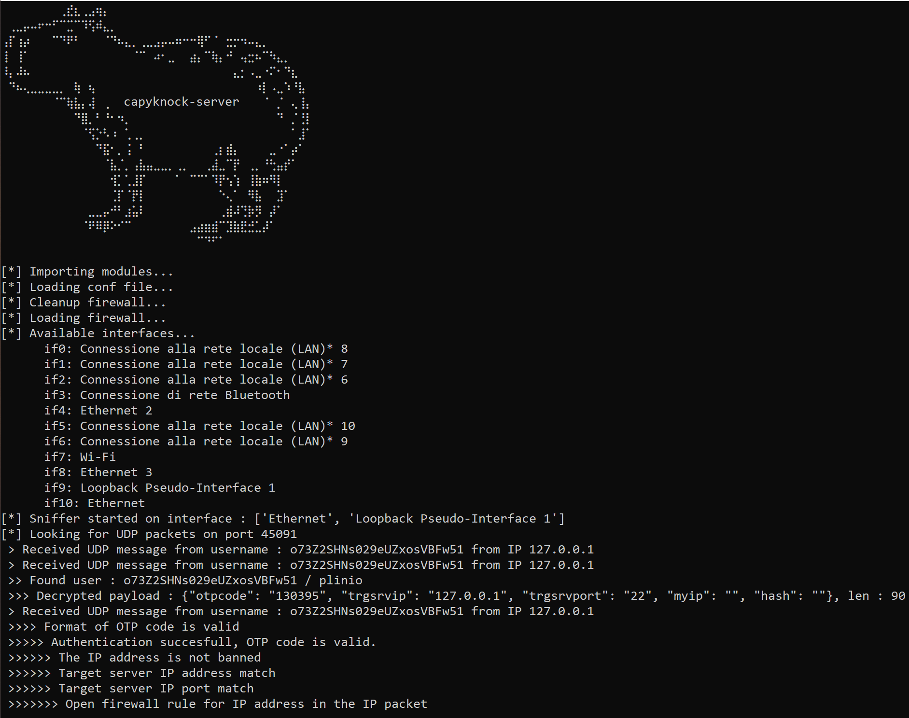
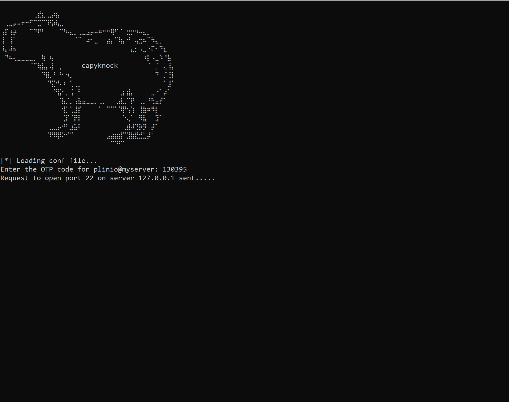

## Hide your server from bot scans

I run a small server that jumps connection via SSH port forwarding to air-gapped machines. As anyone having an SSH service open to the world, the log files was full of russians and chineses people[^1] willing to became friends, not really something to be scared but annoing. In most of the cases there were some few tries per day with IPBan to take care, but there was a point in which I saw a pattern, multiple session at same time from the same IP tring to connect with different usernames, so that they could have tens of tries in a shot before IPBan kicked in. More, within a short time window, IP address from the same pool[^2] doing the same.

There was no reason my server could have been a target for someone, but I started looking for some port knocking, just to have some more peace of mind. I then came across [fwknop](https://github.com/mrash/fwknop) and liked a lot the idea to mix port knocking with encryption. With [fwknop](https://github.com/mrash/fwknop) your server services are hidden and only if you own the keys you can get the services accessible for your IP address.

### Port knocking versus VPN

The development of [fwknop](https://github.com/mrash/fwknop) stopped some years ago, is still based on iptables that are now deprecated, and the server cannot run on Windows[^3]. The rising of Wireguard [had influence on fwknop](https://github.com/mrash/fwknop/issues/344) because its main goal was getting your services stealth and with Wireguard you can achieve the same result. Wireguard could answer my need partially, because I didn't want to deal with the installation of the VPN to my few users. The SSH client is portable and same should have been for the this additional layer I was trying to add.

I the started looking for alternatives till decided to experiment with Python and code my own. I had two main needs that [fwknop](https://github.com/mrash/fwknop) didn't cover[^4], Windows compatibility and a friendly client. But most probably, I coded it just to have a place to put some capybara [ASCII art](https://emojicombos.com/capybara).

### Coding capyknock

It didn't took much to code it, because most of the work is done by Python behind the scenes. The [capyknock](https://github.com/plinioseniore/capyknock) client ask for an OTP and then disappear, all the configuration is done in the [file](https://github.com/plinioseniore/capyknock/blob/main/capyknock_client-conf.json) and it is just a terminal UI. I can then setup a simple batch file that once the client close, starts the SSH connection. So even if you deal with two client the experience is almost seamless.

At the other end the [capyknock](https://github.com/plinioseniore/capyknock) server process the request and grant the access via the firewall, the communication is encrypted and only a client that owns the key can craft a packet that is accepted by the sever, that will otherwise discard it. The server cannot send a response, because it will break the single packet approach and stealthiness, so is the client that probe the TCP connection to understand if the request has been accepted.

### Security and Architecture

Once coded, the main question was if I was creating a bigger problem while trying to solve a problem that didn't exist. The single packet authorization is not an authentication method, so behind there is anyhow an authentication like the SSH one, that is robust and field proven. So the question was, is my code reducing the attach surface or is creating a wider one?

The real answer is *who knows!?*, because unidentified vulnerabilities in the code or in its dependencies may expose to a risk. But a reasonable answer is the surface is reduced and can be considered zero for an external actor, because capyknock and the other services cannot be scanned.

Also the architecture matters, my usage of capyknock is on a **empty box**  that provide public connectivity to a server that has not. Even if someone take over the  **empty box**, it will just be on the front door of an SSH service.

The above sketch shows the overall architecture and network flow: the *Access Box Server* is the entry gateway, users authenticate there via SSH and are allowed to run port-forwards to *Air Gapped Servers*. The *Air Gapped Servers* are networked to the *Access Box Server* via Firewall and NAT, they cannot access the internet via the *Access Box Server*.
The *Access Box Server* itself is connected to the internet but is not reachable from the outside (by choice) and so it establish a tunnel to the *Empty Box Server*, that is a VPS/Cloud server with very low resources.

The SSH Tunnel is estabilshed inside the [Softether](https://www.softether.org/) one (green color) and inside the SSH one (black color) there is the RDP to the target machines.

I could have used [Cloudflare Tunnels](https://community.cloudflare.com/t/tcp-tunnel/489646/2) but with much less fun.

### Running capyknock

You can run capyknock as Python scripts or directly from the [Windows-x64 binaries](https://github.com/plinioseniore/capyknock/releases), in either the cases you should have a network sniffer supported by Scapy, like [libcap/npcap](https://wiki.wireshark.org/libpcap). If you have [Wireshark](https://www.wireshark.org/download.html) already installed you are already done otherwise [download npcap here](https://npcap.com/#download), on your smartphone an app like Google Authenticator (or Microsoft Authenticator and similar) is required to generate the OTP codes.

Configure the server and the client using the [first run notes](https://github.com/plinioseniore/capyknock/blob/main/FIRSTRUN.md), as starting point you can run the communication over the network loopback *127.0.0.1* just to test everything within your machine. Ensure to run the server as administrator and keeping server clock NTP synced (otherwise the OTP validation will fail).

[^1]: Yep, bots.
[^2]: At least likely from the same pool.
[^3]: Yep, I run a server on Windows, but trust me, is just laziness. I would have reinstalled the server on Linux.
[^4]: Don't get me wrong, fwknop have much more options and clients that capyknock. I'm referring to the specific needs I had.